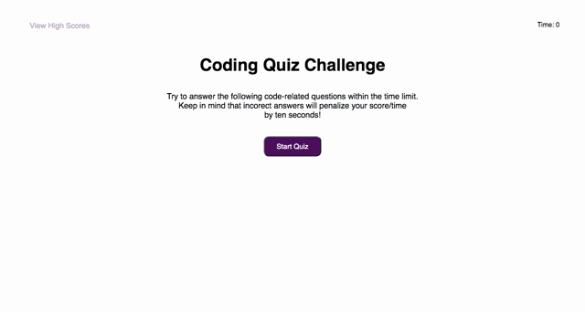

# Code Quiz

## Table of Contents

* [Description](#description)
* [Snippets](#snippets)
* [Technologies](#technologies)
* [Preview](#preview)
* [Links](#links)

## Description

This project consisted on creating a website with a typical coding assessment including a combination of multiple-choice questions and interactive coding challenges.  In other words, a website with a timed coding quiz and multiple choice questions. This website will feature HTML, CSS and it will be powered by JavaScript. 

## Snippets 

* **Event listeners**
```            
start.addEventListener("click", hidingSections);

answB.forEach(item => {
    item.addEventListener('click', checkAnswer);
});

submitScrBtn.addEventListener("click", addScore);

clearScrBtn.addEventListener("click", clearScores);

```            

* **Declaration for questions with correct answers**

```            
const questions = [
    {
        question: "Commonly used data types DO Not Include:",
        answer: ["1. strings", "2. booleans", "3. alerts", "4. numbers"],
        correctAnswer: "2"
    },
    {
        question: "The condition in an if / else statement is enclosed with ____.",
        answer: ["1. quotes", "2. curly brackets", "3. parenthesis", "4. square brackets"],
        correctAnswer: "2"
    },
    {
        question: "Arrays in JavaScript can be used to store ____.",
        answer: ["1. numbers and strings", "2. other arrays", "3. booleans", "4. all of the above"],
        correctAnswer: "3"
    },
    {
        question: "String values must be enclosed within ____ when being assigned to variables.",
        answer: ["1. commas", "2. curly brackets", "3. quotes", "4. parentheses"],
        correctAnswer: "2"
    },
    {
        question: "A very useful tool used during development and debugging for printing content to the debugger is ____.",
        answer: ["1. JavaScript", "2. terminal / bash ", "3. for loops", "4. console.log"],
        correctAnswer: "3"
    }
];
```


* **Starting timer function**
```            
  function setTime() {
    let timerShown= setInterval(function () {
        secondsLeft--;
        time.textContent = `Time:${secondsLeft}s`;

        if (secondsLeft === 0 || questionCount === questions.length) {
            clearInterval(timerShown);
            questionSection.style.display = "none";
            finalScore.style.display = "block";
            viewScrBtn.style.display = "block";
            hr.style.display="none";
            score.textContent = secondsLeft;
        }
    }, 1000);
}
```   


## Technologies

* HTML
* CSS
* JavaScript

## Preview

This is a preview of the coding quiz website in a computer view. 



This is a preview of the coding quiz website in a cell phone view. 


## Links

* [URL of the deployed application](https://analuciarojas.github.io/challenge4/)

* [URL of the GitHub repository](https://github.com/analuciarojas/challenge4)